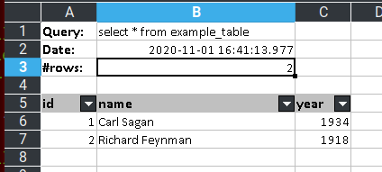

# Database Command Line Query Tool

This is a simple python 3 script to connect and run queries from the command
line. It will export the data in many different file formats, and run many
queries from a sql file.

E.g. run a simple select:

```bash
query "select * from example_table"
```

Output to an Excel spreadsheet:

```bash
query -o output.xlsx "select * from example_table"
```

Output as Json:

```bash
query --json "select * from example_table"
```

It uses JDBC to connect, so most databases can be used. i.e. any you have a
JDBC driver for should work, see [JayDeBeApi](https://pypi.org/project/JayDeBeApi/#supported-databases).)

## tl;dr

- Install Python 3
- Install 3 python libraries:

```bash
  pip install JayDeBeApi
  pip install tabulate
  pip install XlsxWriter
```

- Put `query` script in a folder on your path.
- Put `query-completion.sh` somewhere and `source` it from your start bash/zsh script.
- Download and place the JDBC drivers into a convenient folder.
- Setup `~/.ssh/secret_keys/query.properties` with each of the databases you
  want to connect to.

That's it, you should now be able to run query against a database.

```bash
query "select * from example_table"
```

## Installation

- Download and install [Python 3](https://www.python.org/downloads/)
- Install [JayDeBeApi](https://pypi.org/project/JayDeBeApi/)

  ```bash
  pip install JayDeBeApi
  ```

- Install [Tabulate](https://pypi.org/project/tabulate/)

  ```bash
  pip install tabulate
  ```

- Install [XlsxWriter](https://xlsxwriter.readthedocs.io/)

  ```bash
  pip install XlsxWriter
  ```

- Put `query` script in a folder on your path, probably `~/bin/`.

- Put `query-completion.sh` somewhere (`~/bin/`) and `source` it from your start bash/zsh script.

- Download and copy the JDBC driver[s] for the databases you would like to connect to, you don't need them all just the ones you use.

      - [MySQL](https://dev.mysql.com/downloads/connector/j/)
      - [Oracle](https://www.oracle.com/database/technologies/appdev/jdbc-downloads.html)
      - [Oracle - Older versions](https://www.oracle.com/technetwork/jp/database/enterprise-edition/jdbc9201-083937-ja.html)
      - [Postgres](https://jdbc.postgresql.org/)
      - [SQLlite](https://github.com/xerial/sqlite-jdbc)
      - [SQL Server](https://docs.microsoft.com/en-us/sql/connect/jdbc/)
      - And many more.....

- Setup a properties file which contains the connection details for each database you want to connect to.

  Towards the top of the `query` script there is this line:

  ```python
  PROP_FILE = str(Path.home()) + "/.ssh/secret_keys/query.properties"
  ```

  By default query looks for a file in `~/.ssh/secret_keys/query.properties`.
  Within this file place the connection details for each database. `db.default`
  will be the `default` database. Here is an example using the latest (at the
  time of writing) MySQL driver, two databases are listed one MySQL, `default`,
  and a MSSQL database, `anotherdb.ro`.

```plain
  [db.default]
  db.default.driverpath=./JavaDBdrivers/mysql-connector-java-8.0.22.jar
  db.default.driver=com.mysql.cj.jdbc.Driver
  db.default.url=jdbc:mysql://localhost:3306/example
  db.default.username=root
  db.default.password=pa55word

  [db.anotherdb.ro]
  db.anotherdb.ro.driverpath=/home/jim/Downloads/Done/JavaDBdrivers/MicrosoftSQL/sqljdbc42.jar
  db.anotherdb.ro.driver=com.microsoft.sqlserver.jdbc.SQLServerDriver
  db.anotherdb.ro.url=jdbc:sqlserver://192.1.2.3:1433;databaseName=ADB
  db.anotherdb.ro.username=auser
  db.anotherdb.ro.password=apassword
```

### Docker Quick Start MySQL with example data

I've included a Dockerfile so you can easily get a MySQL database and test data
installed. The whole installation and setup of the database, literally takes
60 seconds from scratch (assuming you have docker installed). Here are the
instructions:

- To build a MySQL image with the users/schema all setup use:

```bash
docker build -t="query-tool-database" .
```

- Then to run the image in a container on port 3306:

```bash
docker run --name query-tool-database -p 3306:3306 -d query-tool-database
```

You will now have a MySQL database which contains a schema called **example**
which contains a table called **example_table**.

- If you need to you can connect to the terminal:

```bash
docker exec -i -t query-tool-database /bin/bash
```

- To stop and remove the container and image use the following:

```bash
docker stop query-tool-database
docker rm query-tool-database
docker rmi query-tool-database
```

In the `query.properties` example above, the `default` database will connect
to this docker database.

## Usage

#### Help

- `query --help`
- `query -h`

```plain
usage: query [-h]
             [-d {default,anotherdb.ro}]
             [-n] [-c] [-s] [-t] [-v]
             [-j | -m | -f {plain,simple,github,grid,fancy_grid,pipe,orgtbl,
                            jira,presto,pretty,psql,rst,mediawiki,moinmoin,
                            youtrack,html,latex,latex_raw,latex_booktabs,textile} | -o OUTPUT]
             [-l]
             [sql_file_or_query]

query - A versatile command line query tool - v0.1 - Jim Cornmell DB
connection properties are read from {PROP_FILE}

positional arguments:
  sql_file_or_query     A query or sql file to run

optional arguments:
  -h, --help            show this help message and exit
  -d {default,anotherdb.ro}, --database {default,anotherdb.ro}
                        Database to run queries against
  -n, --no-header       no header, default prints header row
  -c, --count           output total number of rows
  -s, --show-query      Show the query
  -t, --show-time       Show the time at which the query ran
  -v, --verbose         Show the count, query, time
  -j, --json            output Json
  -m, --simple          siMple format
  -f {plain,simple,github,grid,fancy_grid,pipe,orgtbl,jira,presto,pretty,psql,
      rst,mediawiki,moinmoin,youtrack,html,latex,latex_raw,latex_booktabs,textile},
      --format {plain,simple,github,grid,fancy_grid,pipe,orgtbl,jira,presto,
                pretty,psql,rst,mediawiki,moinmoin,youtrack,html,latex,
                latex_raw,latex_booktabs,textile}
                        Format, options are listed
  -o OUTPUT, --output OUTPUT
                        Output as CSV, XLSX, SQL, HTML, JSON file
  -l, --list-databases  Show the possible databases
```

#### Simple query against the default database

- `query -d default "select * from example_table"`

As this is the default database you do not need the -d option, so the following
will work the same.

- `query "select * from example_table"`

```
╒══════╤═════════════════╤════════╕
│   id │ name            │   year │
╞══════╪═════════════════╪════════╡
│    1 │ Carl Sagan      │   1934 │
├──────┼─────────────────┼────────┤
│    2 │ Richard Feynman │   1918 │
╘══════╧═════════════════╧════════╛
```

#### Changing to other databases

Just use the name of your database connection from the query.properties file
(remove the leading "db." though).

- Use option `-d` for **D**atabase.

- `query -d default "select * from example_table"`

#### Display number of rows returned

- Use option `-c` for **C**ount.
- `query -c "select * from example_table"`

```
╒══════╤═════════════════╤════════╕
│   id │ name            │   year │
╞══════╪═════════════════╪════════╡
│    1 │ Carl Sagan      │   1934 │
├──────┼─────────────────┼────────┤
│    2 │ Richard Feynman │   1918 │
╘══════╧═════════════════╧════════╛
2
```

#### Show the query

- Use option `-s` for **S**how.
- `query -s "select * from example_table"`

```
select * from example_table
╒══════╤═════════════════╤════════╕
│   id │ name            │   year │
╞══════╪═════════════════╪════════╡
│    1 │ Carl Sagan      │   1934 │
├──────┼─────────────────┼────────┤
│    2 │ Richard Feynman │   1918 │
╘══════╧═════════════════╧════════╛
```

#### Display the time the query ran

- Use option `-t` for **T**ime.
- `query -t "select * from example_table"`

```
2020-11-01 13:17:07.986766
╒══════╤═════════════════╤════════╕
│   id │ name            │   year │
╞══════╪═════════════════╪════════╡
│    1 │ Carl Sagan      │   1934 │
├──────┼─────────────────┼────────┤
│    2 │ Richard Feynman │   1918 │
╘══════╧═════════════════╧════════╛
```

#### Verbose output

- Use option `-v` for **V**erbose.
- Shorthand for using `-c`, `-s` and `-t`.
- `query -v "select * from example_table"`

```
select * from example_table
2020-11-01 13:17:42.948351
╒══════╤═════════════════╤════════╕
│   id │ name            │   year │
╞══════╪═════════════════╪════════╡
│    1 │ Carl Sagan      │   1934 │
├──────┼─────────────────┼────────┤
│    2 │ Richard Feynman │   1918 │
╘══════╧═════════════════╧════════╛
2
```

#### Output as json

- `query -j "select * from example.example_table"`

```
{ "table": "example.example_table", "tableData": [{"id": 1, "name": "Carl Sagan", "year": 1934},{"id": 2, "name": "Richard Feynman", "year": 1918}]}
```

Note you can use the `-v` option with this, but the output will not be adjusted
to be json complient:

- `query -v -j "select * from example_table"`

```
select * from example.example_table
2021-03-04 09:59:42.201533
{ "table": "example.example_table", "tableData": [{"id": 1, "name": "Carl Sagan", "year": 1934},{"id": 2, "name": "Richard Feynman", "year": 1918}]}2
```

If you wish to name the table something else use -a as follows (this is also piped though jq for formatting).

```
query -j "select * from example.example_table" -a example.anothername | jq

```

And you should see:

```
{
  "table": "example.anothername",
  "tableData": [
    {
      "id": 1,
      "name": "Carl Sagan",
      "year": 1934
    },
    {
      "id": 2,
      "name": "Richard Feynman",
      "year": 1918
    }
  ]
}
```

You can also output directly to a json file as follows, note the file is appended to if it already exists:

```
query -o a.json -a schema_name.table_name "select * from example.example_table"
```

#### Output as simpler format

- `query -m "select * from example_table"`

  Shorthand for:

- `query -f simple "select * from example_table"`

```
  id  name               year
----  ---------------  ------
   1  Carl Sagan         1934
   2  Richard Feynman    1918
```

#### Output without header row

- `query -n "select * from example_table"`

```
╒═══╤═════════════════╤══════╕
│ 1 │ Carl Sagan      │ 1934 │
├───┼─────────────────┼──────┤
│ 2 │ Richard Feynman │ 1918 │
╘═══╧═════════════════╧══════╛
```

#### Output as another format

- `query -f psql "select * from example_table"`

```
+------+-----------------+--------+
|   id | name            |   year |
|------+-----------------+--------|
|    1 | Carl Sagan      |   1934 |
|    2 | Richard Feynman |   1918 |
+------+-----------------+--------+
```

- `query -f html "select * from example_table"`

```
<table>
<thead>
<tr><th style="text-align: right;">  id</th><th>name           </th><th style="text-align: right;">  year</th></tr>
</thead>
<tbody>
<tr><td style="text-align: right;">   1</td><td>Carl Sagan     </td><td style="text-align: right;">  1934</td></tr>
<tr><td style="text-align: right;">   2</td><td>Richard Feynman</td><td style="text-align: right;">  1918</td></tr>
</tbody>
</table>
```

#### Output to a file

##### CSV

- `query -o file.csv "select * from example_table"`

The contents of file.csv will be:

```
"id","name","year"
1, "Carl Sagan", 1934
2, "Richard Feynman", 1918
```

##### Excel XLSX format

- `query -v -o file.xlsx "select * from example_table"`
  The contents of file.xlsx will be:



#### Input from a SQL file.

Rather than providing the query on the command line you can simply specify a
sql file to run. If done each SQL command MUST end with a semi-colon.

Here is an example file, `input.sql`, containing three SQL statements:

```sql
SELECT * FROM example_table;
SELECT * FROM example_table WHERE year > 1930;
SELECT * FROM example_table WHERE year < 1930;
```

- `query input.sql`

```
╒══════╤═════════════════╤════════╕
│   id │ name            │   year │
╞══════╪═════════════════╪════════╡
│    1 │ Carl Sagan      │   1934 │
├──────┼─────────────────┼────────┤
│    2 │ Richard Feynman │   1918 │
╘══════╧═════════════════╧════════╛

╒══════╤════════════╤════════╕
│   id │ name       │   year │
╞══════╪════════════╪════════╡
│    1 │ Carl Sagan │   1934 │
╘══════╧════════════╧════════╛

╒══════╤═════════════════╤════════╕
│   id │ name            │   year │
╞══════╪═════════════════╪════════╡
│    2 │ Richard Feynman │   1918 │
╘══════╧═════════════════╧════════╛
```

- `query -v input.sql`

```
Reading input from SQL file input.sql...
SELECT
  *
FROM
  example_table
2020-11-01 16:57:40.831653
╒══════╤═════════════════╤════════╕
│   id │ name            │   year │
╞══════╪═════════════════╪════════╡
│    1 │ Carl Sagan      │   1934 │
├──────┼─────────────────┼────────┤
│    2 │ Richard Feynman │   1918 │
╘══════╧═════════════════╧════════╛
2

SELECT
  *
FROM
  example_table
WHERE
  year > 1930
2020-11-01 16:57:40.891882
╒══════╤════════════╤════════╕
│   id │ name       │   year │
╞══════╪════════════╪════════╡
│    1 │ Carl Sagan │   1934 │
╘══════╧════════════╧════════╛
1

SELECT
  *
FROM
  example_table
WHERE
  year < 1930
2020-11-01 16:57:40.893991
╒══════╤═════════════════╤════════╕
│   id │ name            │   year │
╞══════╪═════════════════╪════════╡
│    2 │ Richard Feynman │   1918 │
╘══════╧═════════════════╧════════╛
1
```

You can also output to csv.

- `query -o file.csv input.sql`

```
"id","name","year"
1, "Carl Sagan", 1934
2, "Richard Feynman", 1918

"id","name","year"
1, "Carl Sagan", 1934

"id","name","year"
2, "Richard Feynman", 1918
```

#### Run SQL file with many queries to Excel spreadsheet

You can read many queries from a sql file and export to Excel XLSX file. Note
that the resulting spreadsheet will have as many worksheets as there are
queries. Sheet1 will be the first query, Sheet2 the second and so on.

- `query -o file.xlsx input.sql`

Or use verbose to output info with each table.

- `query -v -o file.xlsx input.sql`
